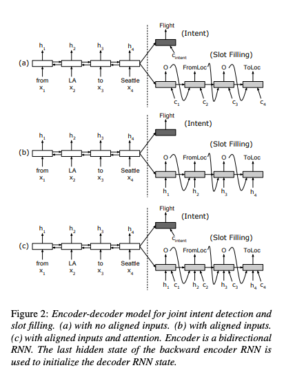
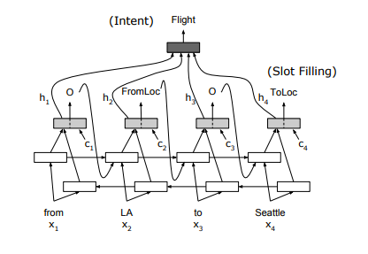

Attention-based RNN model for Spoken Language Understanding (Intent Detection & Slot Filling)
==================
This is a Tensorflow implementation of attention-based LSTM models for sequence classification and sequence labeling.

This is the encoder-decoder model with the aligned inputs.

The attention based RNN model

**Training Procedure**
LSTM cell is used as the basic RNN unit in the experiments. Our LSTM implementation follows the design. Given
the size the data set, we set the number of units in LSTM cell as 128. The default forget gate bias is set to 1. We use only
one layer of LSTM in the proposed models, and deeper models by stacking the LSTM layers are to be explored in future work. Word embeddings of size 128 are randomly initialized and fine-tuned during mini-batch training with batch size of 16. Dropout rate 0.5 is applied to the non-recurrent connections during model training for regularization. Maximum norm for gradient clipping is set to 5. We use Adam optimization method following the suggested parameter setup.

**Reference**

* Bing Liu, Ian Lane, "Attention-Based Recurrent Neural Network Models for Joint Intent Detection and Slot Filling", Interspeech, 2016 (<a href="http://www.isca-speech.org/archive/Interspeech_2016/pdfs/1352.PDF" target="_blank">PDF</a>)

