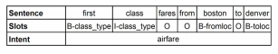

Attention-based RNN model for Spoken Language Understanding (Intent Detection & Slot Filling)
==================
This is a Tensorflow implementation of attention-based LSTM models for sequence classification and sequence labeling.

In slot filling, the input sequence and label sequence are of the same length, and thus there is explicit alignment.

However, in intent detection, the output is not fixed.

**Sample with intent and slot detection**

## Encoder-Decoder: 
Encoder and decoder are two sperate RNNs, 
The encoder takes the whole vector as a seqeunce and gets a iutput vector c. This vector c is used in a decoder to genrate the target output sequnce.
Whereas the RNN sequence labler can only label the i-o-b format of the input sequence.

**Encoder-decoder model with the aligned inputs**

**Attention based RNN model**

**Reference**

* Bing Liu, Ian Lane, "Attention-Based Recurrent Neural Network Models for Joint Intent Detection and Slot Filling", Interspeech, 2016 (<a href="http://www.isca-speech.org/archive/Interspeech_2016/pdfs/1352.PDF" target="_blank">PDF</a>)

